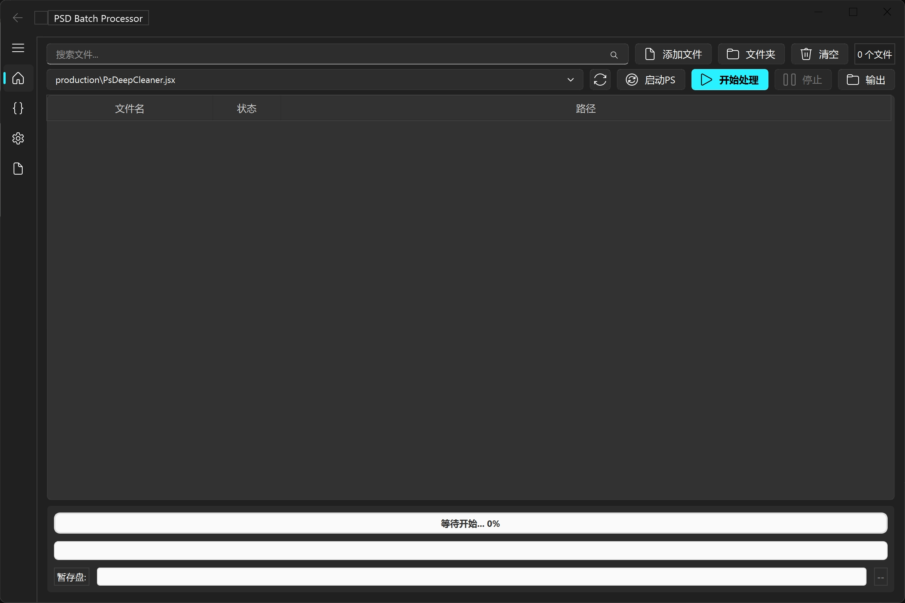
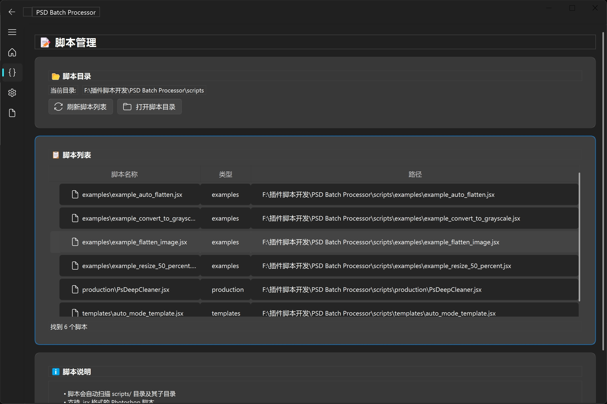
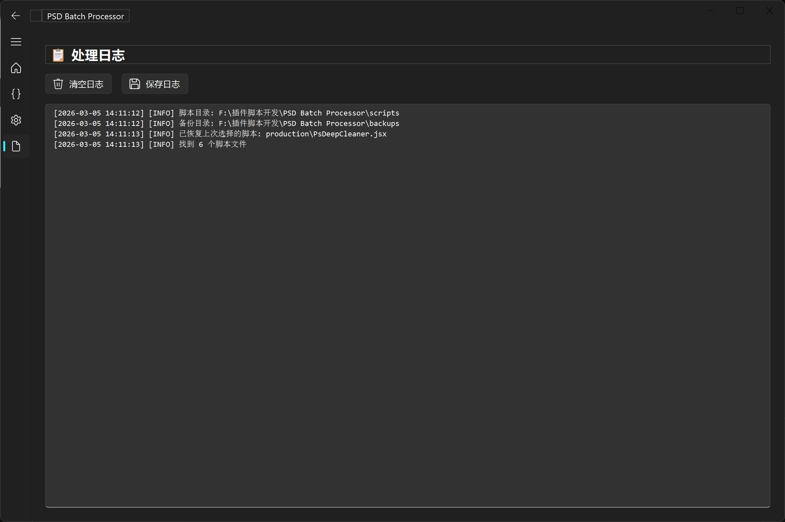
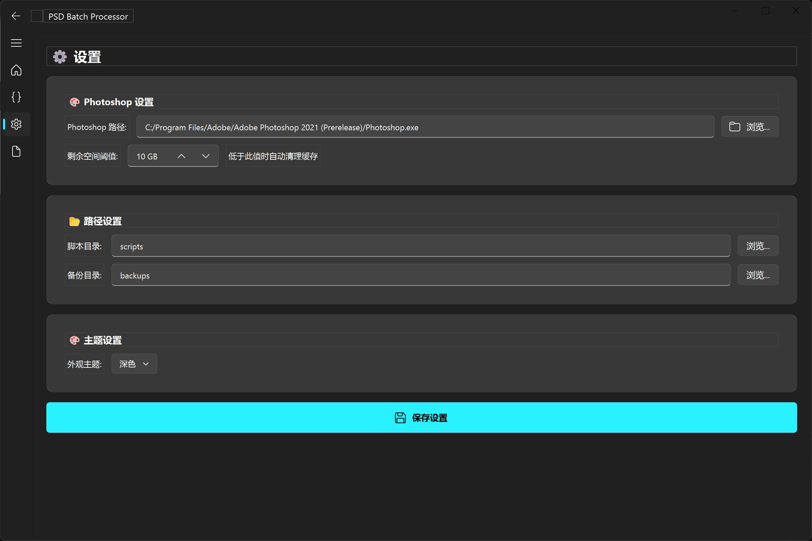

# PSD Batch Processor - PyQt-Fluent-Widgets 版本

<div align="center">


**现代化、美观的 PSD 批量处理器**

🌐 [产品官网](https://yancongya.github.io/PSD-Batch-Processor/) | 📦 [下载安装](https://github.com/yancongya/PSD-Batch-Processor/releases)

</div>

## 🎯 特点

### ✨ 界面特性
- **Fluent Design 风格**: Windows 11 原生风格界面
- **多页面导航**: 主页、设置、日志三个独立页面
- **卡片式布局**: 清晰的功能分区
- **实时反馈**: 进度条、日志、信息提示
- **主题切换**: 深色/浅色主题支持

### 🚀 功能特性
- **批量处理**: 支持多文件并发处理
- **脚本管理**: 递归扫描子目录中的 JSX 脚本
- **文件管理**: 支持添加文件/文件夹，实时状态显示
- **备份机制**: 自动创建时间戳备份文件夹
- **完整日志**: 实时日志查看和保存

### 🎨 用户体验
- **响应式设计**: 适应不同窗口尺寸
- **流畅动画**: 平滑的界面过渡
- **信息提示**: 优雅的错误/警告/成功提示
- **快捷操作**: 一键打开输出文件夹

## 🚀 快速开始

### 方式 1：下载预编译版本（推荐）

直接从 GitHub Releases 下载预编译的可执行文件：

1. **访问 Release 页面**：
   https://github.com/yancongya/PSD-Batch-Processor/releases

2. **下载最新版本**：
   - `PSDBatchProcessor-vX.X.X.zip`
   - 包含三个版本：Windowed、Console、OneFile

3. **解压并运行**：
   - Windowed 版本：双击 `PSDBatchProcessor-Windowed.exe`
   - Console 版本：双击 `PSDBatchProcessor-Console.exe`
   - OneFile 版本：双击 `PSDBatchProcessor-OneFile.exe`

### 方式 2：从源码运行

#### 1. 安装依赖

#### 方法 A: 使用安装脚本（推荐）
```bash
python tools\install_fluent.py
```

#### 方法 B: 手动安装
```bash
pip install PyQt5 PyQt-Fluent-Widgets pywin32 Pillow
```

### 2. 启动应用

#### 方法 A: 使用启动脚本（推荐）
```bash
python tools\run_fluent.py
```

#### 方法 B: 直接运行
```bash
python src\main_fluent.py
```

### 3. 首次配置

1. **设置 Photoshop 路径**
   - 点击"浏览..."按钮
   - 选择 Photoshop.exe (通常在 `C:\Program Files\Adobe\Adobe Photoshop 2025\Photoshop.exe`)

2. **刷新脚本列表**
   - 点击"刷新"按钮
   - 系统会自动扫描 `scripts/` 目录及其子目录

3. **添加文件**
   - 点击"添加文件"选择 PSD 文件
   - 或点击"添加文件夹"批量添加

4. **开始处理**
   - 选择要执行的脚本
   - 点击"开始处理"按钮

## 📁 项目结构

```
PSD Batch Processor/
├── src/
│   ├── app/
│   │   ├── config/
│   │   │   └── settings.py              # 配置管理
│   │   ├── core/
│   │   │   ├── processor.py             # 批量处理逻辑
│   │   │   ├── photoshop_controller.py  # Photoshop COM 控制
│   │   │   └── script_args.py           # 脚本参数传递
│   │   ├── models/
│   │   │   └── file_item.py             # 文件数据模型
│   │   └── ui/
│   │       ├── main_window.py           # CustomTkinter 主窗口
│   │       └── fluent_main_window.py    # PyQt-Fluent-Widgets 主窗口
│   ├── utils/
│   │   └── logger.py                    # 日志系统
│   ├── main.py                          # CustomTkinter 启动脚本
│   └── main_fluent.py                   # PyQt-Fluent-Widgets 启动脚本
├── scripts/
│   ├── production/                      # 生产脚本
│   ├── templates/                       # 模板脚本
│   └── examples/                        # 示例脚本
├── tools/
│   ├── install_fluent.py                # PyQt-Fluent-Widgets 安装脚本
│   ├── run_fluent.py                    # PyQt-Fluent-Widgets 启动脚本
│   ├── build.bat                        # 打包工具 (CustomTkinter)
│   └── build.py                         # 打包工具 (Python)
├── docs/
│   ├── FLUENT_VERSION_GUIDE.md          # PyQt-Fluent-Widgets 指南
│   ├── PACKAGING_GUIDE.md               # 打包指南
│   └── guides/                          # 使用文档
├── tests/
│   └── test_fluent_widgets.py           # PyQt-Fluent-Widgets 测试
├── requirements.txt                     # 依赖列表
├── README.md                            # 主 README
└── README_FLUENT.md                     # 本文档
```

## 🖼️ 软件截图

### 主页界面


### 脚本管理


### 日志查看


### 设置界面


## 🔗 产品官网

访问产品官网了解更多信息和最新动态：
https://yancongya.github.io/PSD-Batch-Processor/

## 🎨 界面预览

### 主页界面
```
┌─────────────────────────────────────────────────────────┐
│ ⭐ PSD 批量处理器                                         │
├─────────────────────────────────────────────────────────┤
│ ⚙️ 设置                                                  │
│   Photoshop 路径: [C:\...\Photoshop.exe] [浏览...]      │
│   选择脚本:     [example.jsx ▼] [刷新]                  │
│   并发数:       [1 ▲▼]                                  │
├─────────────────────────────────────────────────────────┤
│ 📁 文件列表                                              │
│   [添加文件] [添加文件夹] [清空]                         │
│   ┌─────────────────────────────────────────────────┐   │
│   │ 文件名          状态      路径                  │   │
│   │ test.psd        待处理    C:\...\test.psd       │   │
│   │ demo.psd        待处理    C:\...\demo.psd       │   │
│   └─────────────────────────────────────────────────┘   │
│   就绪 - 2 个文件                                        │
├─────────────────────────────────────────────────────────┤
│ [开始处理] [停止] [打开输出文件夹]                       │
├─────────────────────────────────────────────────────────┤
│ 📋 日志预览                                              │
│   [2026-01-24 12:00:00] [INFO] 脚本目录: ...            │
│   [2026-01-24 12:00:01] [INFO] 备份目录: ...            │
└─────────────────────────────────────────────────────────┘
```

### 设置界面
```
┌─────────────────────────────────────────────────────────┐
│ ⚙️ 设置                                                  │
├─────────────────────────────────────────────────────────┤
│ 🎨 主题设置                                             │
│   外观主题: [深色 ▼]                                    │
├─────────────────────────────────────────────────────────┤
│ 📂 路径设置                                             │
│   脚本目录: [scripts] [浏览...]                         │
│   备份目录: [backups] [浏览...]                         │
│   [保存设置]                                            │
└─────────────────────────────────────────────────────────┘
```

### 日志界面
```
┌─────────────────────────────────────────────────────────┐
│ 📋 处理日志                                              │
├─────────────────────────────────────────────────────────┤
│ [清空日志] [保存日志]                                   │
├─────────────────────────────────────────────────────────┤
│ [2026-01-24 12:00:00] [INFO] 开始处理 2 个文件          │
│ [2026-01-24 12:00:01] [INFO] 使用脚本: example.jsx      │
│ [2026-01-24 12:00:02] [INFO] test.psd: 处理中           │
│ [2026-01-24 12:00:05] [SUCCESS] test.psd: 完成          │
│ [2026-01-24 12:00:10] [SUCCESS] 处理完成                │
└─────────────────────────────────────────────────────────┘
```

## 🔧 使用指南

### 添加文件

#### 添加单个文件
1. 点击"添加文件"按钮
2. 选择 PSD 文件（可多选）
3. 文件会出现在文件列表中

#### 添加文件夹
1. 点击"添加文件夹"按钮
2. 选择包含 PSD 文件的文件夹
3. 系统会递归扫描所有子目录
4. 所有 PSD 文件会添加到列表中

### 选择脚本

1. **刷新脚本列表**
   - 点击"刷新"按钮
   - 系统扫描 `scripts/` 目录及其子目录
   - 显示所有 `.jsx` 脚本

2. **选择脚本**
   - 从下拉框中选择脚本
   - 脚本路径会显示在下拉框中
   - 支持子目录中的脚本（显示为 `子目录/脚本名`）

### 开始处理

1. **验证配置**
   - ✅ Photoshop 路径已设置
   - ✅ 已选择脚本
   - ✅ 已添加文件

2. **开始处理**
   - 点击"开始处理"按钮
   - 查看进度条和日志
   - 等待处理完成

3. **处理结果**
   - 成功：显示绿色提示，文件状态变为"完成"
   - 失败：显示红色提示，文件状态变为"失败"
   - 备份：自动创建时间戳备份文件夹

### 查看日志

#### 预览日志（主页）
- 显示最近的日志消息
- 自动滚动到最新消息
- 限制显示行数以保持性能

#### 完整日志（日志页面）
- 查看所有历史日志
- 清空或保存日志到文件
- 支持搜索和复制

## ⚙️ 配置说明

### 应用配置

配置文件位置：
- **开发环境**: `src/config.json`
- **打包后**: `%APPDATA%\PSDBatchProcessor\config.json`

配置项说明：
```json
{
  "photoshop_path": "Photoshop.exe 完整路径",
  "script_dir": "脚本目录路径（相对或绝对）",
  "backup_dir": "备份目录路径（相对或绝对）",
  "last_script": "上次使用的脚本名称",
  "max_workers": "并发处理数量（1-8）",
  "theme": "主题（dark/light）",
  "include_subfolders": "是否扫描子目录"
}
```

### 主题配置

支持两种主题：
- **深色主题** (`dark`): 适合暗光环境，护眼
- **浅色主题** (`light`): 适合明亮环境

切换主题会立即生效，并保存到配置文件。

## 📊 性能优化

### 并发处理
- **并发数设置**: 1-8 个文件同时处理
- **推荐设置**:
  - CPU 4核以下: 1-2
  - CPU 4-8核: 2-4
  - CPU 8核以上: 4-8

### 内存管理
- **文件列表限制**: 无硬限制，但建议不超过 1000 个文件
- **日志缓存**: 自动限制行数，避免内存溢出
- **临时文件**: 处理完成后自动清理

### 响应速度
- **UI 响应**: 使用 QThread 避免界面卡顿
- **实时更新**: 使用信号槽机制，确保线程安全
- **滚动优化**: 日志自动滚动，避免性能问题

## 🔍 故障排除

### 常见问题

#### 1. 无法导入 PyQt-Fluent-Widgets
```bash
# 重新安装
pip uninstall PyQt-Fluent-Widgets PyQt5
pip install PyQt-Fluent-Widgets PyQt5
```

#### 2. 界面显示异常
```bash
# 检查 Python 版本
python --version  # 需要 3.8+

# 重新安装依赖
pip install --upgrade PyQt5 PyQt-Fluent-Widgets
```

#### 3. Photoshop 无法启动
- 检查路径是否正确
- 确保 Photoshop 已安装
- 以管理员权限运行应用

#### 4. 脚本无法找到
- 点击"刷新"按钮重新扫描
- 检查脚本目录设置
- 确保脚本扩展名为 `.jsx`

#### 5. 处理速度慢
- 降低并发数设置
- 检查系统资源使用
- 确保 Photoshop 响应正常

### 日志分析

查看日志了解详细错误信息：
1. **INFO**: 一般信息，正常流程
2. **SUCCESS**: 成功消息
3. **WARNING**: 警告信息，不影响运行
4. **ERROR**: 错误信息，需要处理

## 📦 打包发布

### 自动构建（推荐）

项目使用 GitHub Actions 进行自动构建和发布：

- **触发方式**：推送 `v*` 标签时自动构建
- **构建内容**：Windowed、Console、OneFile 三个版本
- **发布位置**：https://github.com/yancongya/PSD-Batch-Processor/releases
- **版本控制**：基于 Git 标签管理

**示例**：
```bash
# 创建新版本标签并推送，自动触发构建
git tag v1.0.1
git push origin v1.0.1
```

### 手动构建

#### 使用一键构建脚本（最简单）

**Windows 用户**：
```batch
# 双击运行
tools\build.bat
```

**跨平台**：
```bash
# 运行 Python 脚本
python tools/build_all.py
```

#### 使用 PyInstaller 手动打包

```bash
# 安装 PyInstaller
pip install pyinstaller

# 打包 PyQt-Fluent-Widgets 版本
pyinstaller ^
    --name="PSDBatchProcessor_Fluent" ^
    --noconsole ^
    --onefile ^
    --add-data="docs/guides/START_HERE.txt;docs/guides" ^
    --add-data="docs/guides/QUICK_REFERENCE.txt;docs/guides" ^
    --add-data="scripts/production/*.jsx;scripts/production" ^
    --add-data="scripts/templates/*.jsx;scripts/templates" ^
    --add-data="scripts/examples/*.jsx;scripts/examples" ^
    --hidden-import=win32com ^
    --hidden-import=pythoncom ^
    --hidden-import=PIL ^
    --hidden-import=PyQt5 ^
    --hidden-import=PyQtFluentWidgets ^
    src/main_fluent.py
```

详细打包说明请查看 [docs/PACKAGING_GUIDE.md](docs/PACKAGING_GUIDE.md)。

## 🤝 版本对比

| 特性 | CustomTkinter 版本 | PyQt-Fluent-Widgets 版本 |
|------|-------------------|-------------------------|
| **界面风格** | 现代化，类似 Material Design | Fluent Design (Windows 11) |
| **导航方式** | 单页面布局 | 多页面导航 (侧边栏) |
| **控件丰富度** | 基础控件 | 丰富的高级控件 |
| **主题支持** | 深色/浅色主题 | 完整的 Fluent 主题系统 |
| **响应式设计** | 良好 | 优秀 |
| **学习曲线** | 简单 | 中等 |
| **依赖大小** | 较小 (~50MB) | 较大 (~80MB) |
| **启动速度** | 快 (~1-2秒) | 中等 (~2-3秒) |
| **系统集成** | 一般 | 优秀 (Windows) |

## 🎯 选择建议

### 选择 PyQt-Fluent-Widgets 版本，如果你：
- ✅ 追求现代化、美观的界面
- ✅ 喜欢 Windows 11 风格
- ✅ 需要丰富的控件和交互
- ✅ 重视用户体验
- ✅ 不介意稍大的依赖包

### 选择 CustomTkinter 版本，如果你：
- ✅ 需要轻量级应用
- ✅ 追求快速启动
- ✅ 偏好简洁界面
- ✅ 需要跨平台一致性
- ✅ 希望依赖包较小

## 📚 学习资源

### PyQt-Fluent-Widgets
- **GitHub**: https://github.com/zhiyiYo/PyQt-Fluent-Widgets
- **文档**: https://pyqt-fluent-widgets.readthedocs.io/
- **示例**: https://github.com/zhiyiYo/PyQt-Fluent-Widgets/tree/main/examples

### PyQt5
- **官方文档**: https://www.riverbankcomputing.com/static/Docs/PyQt5/
- **教程**: https://www.learnpyqt.com/

## 🔗 相关链接

- **产品官网**: https://yancongya.github.io/PSD-Batch-Processor/
- **项目主页**: [README.md](README.md)
- **GitHub 仓库**: https://github.com/yancongya/PSD-Batch-Processor
- **发布页面**: https://github.com/yancongya/PSD-Batch-Processor/releases
- **打包指南**: [docs/PACKAGING_GUIDE.md](docs/PACKAGING_GUIDE.md)
- **快速开始**: [docs/guides/START_HERE.txt](docs/guides/START_HERE.txt)
- **参考手册**: [docs/guides/QUICK_REFERENCE.txt](docs/guides/QUICK_REFERENCE.txt)

## 📝 更新日志

### v1.0.0 (2026-01-24)
- ✨ 首次发布 PyQt-Fluent-Widgets 版本
- ✨ 实现多页面导航界面
- ✨ 添加卡片式布局设计
- ✨ 集成现有后端处理逻辑
- ✨ 实现实时日志和进度显示
- ✨ 添加主题切换功能
- ✨ 优化响应式设计

## 🤝 贡献

欢迎提交 Issue 和 Pull Request！

## 📄 许可证

MIT License - 详见 [LICENSE](LICENSE) 文件

## 🙏 致谢

- **PyQt-Fluent-Widgets**: 提供现代化的 UI 组件
- **PyQt5**: 提供 Python Qt 绑定
- **Photoshop**: 提供强大的图像处理能力

---

**版本**: 1.0.0
**更新日期**: 2026-01-24
**状态**: ✅ 生产就绪